# deterministic-exchange-rs

[](https://github.com/Ninian-Lemain/deterministic-exchange-rs/actions/workflows/ci.yml)
[](LICENSE-MIT)
[](https://www.rust-lang.org/)

A Rust workspace for price-time matching, pre-trade risk, sequenced commands,
bounded events, and state recovery. It provides a multi-instrument router and
a separate single-instrument journaled engine. Both use the same matching core.

Current version: **v0.19.0**. The v0.13 dedicated Linux qualification still
needs hardware. Combined fault qualification, engine integration, and operations
work also remain open. The project is not production ready. See the
[documentation index](docs/README.md) and [roadmap](docs/ROADMAP.md).

## Workflow Diagrams

The router does not journal commands. The engine enqueues them before gateway
application. Events report application, not durability. Session admission
remains caller-managed.

[](docs/diagrams/system-overview.svg)

Open a diagram below for the full flow. Each image links to its full-size SVG.

<details>
<summary>Routed commands and events</summary>

[](docs/diagrams/packet-to-report.svg)

The router parses a borrowed frame into a fixed-size new, cancel, or replace
command. Each shard checks its sequence after dequeue. Event pressure retains
one pending command. Events are ordered within a shard, not merged across
shards. Parse, route, and sequence errors return without an event or sequence
advance. Replay digests are separate from this processing path.

</details>

<details>
<summary>Journaled engine and persistence</summary>

[](docs/diagrams/journaled-engine.svg)

`EngineStorage` owns the event and journal queues. The builder returns the
engine and both consumers without creating threads. Admission enqueues the
journal record before gateway application. The persistence worker writes and
flushes separately. Events report application, not durability. An in-flight
command can race a persistence failure. A full event or journal queue refuses
admission before mutation. Observed persistence or internal failures stop the
engine.

</details>

<details>
<summary>New-order transaction</summary>

[](docs/diagrams/new-order-transaction.svg)

This is the gateway application shared by both paths after admission. Business
rejections consume sequence and may advance order ID watermarks. Book rejection
releases the taker reservation. It does not rewind the whole gateway state.

</details>

<details>
<summary>Shutdown and recovery</summary>

[](docs/diagrams/recovery-lifecycle.svg)

Snapshots require stopped admission and completed persistence. Event drain is
the caller's responsibility, not a snapshot precondition. Restore uses fresh
queues and the original report bound. Snapshot selection, retention, and a
persisted configuration manifest remain open.

</details>

See the [documentation index](docs/README.md), [architecture](docs/ARCHITECTURE.md),
and [diagram sources](docs/diagrams/README.md).

## Design Rules

- The parser borrows the RX frame. A normalized command crosses cores as one
  bounded copy into a preallocated SPSC slot.
- Queue pressure refuses admission before gateway mutation. Book and risk
  capacity rejections consume a valid sequence without overwriting live orders.
- One writer per book. An instrument shard owns its risk state and order
  book, so the hot path takes no locks.
- Integer prices and quantities. No logging, formatting, syscalls, or
  allocation in the measured packet-to-report path.
- Unsafe is limited to the SPSC queue, FFI boundary and its ABI tests, and
  benchmark counting allocator. [Safety](docs/SAFETY.md) lists the exact files.
- Strict inbound sequencing, owner-authorized cancel, partial-fill
  reservation accounting, fail-closed capacity behavior.

## Build, Test, Benchmark

Requirements: Rust 1.85 or newer (see `rust-toolchain.toml`), with `rustfmt`
and Clippy. The engine itself builds on stable Rust with no third-party
dependencies.

```console
cargo build --workspace --release
cargo test --workspace
cargo test --workspace --all-features
cargo run --release -p hft-cli -- replay-demo
cargo run --release -p hft-bench
```

The benchmark executable checks allocation deltas around declared hot paths.
[Performance evidence](docs/PERFORMANCE.md) records the measurement boundaries
and known session fixture gaps. See [QUICKSTART.md](QUICKSTART.md) for all
validation commands.

Supported platforms: the engine is portable safe Rust, tested on Windows and
Linux x86_64. Linux is the reference platform for latency qualification.
Desktop timings do not establish production latency.

## Memory Layout and Cache Behavior

- Every hot-path structure is a fixed-capacity flat array sized at compile
  time: accounts, reservations, orders, price levels, reports, queue slots.
  Memory is reserved at initialization.
- Orders inside a price level form an intrusive doubly linked FIFO over
  stable slot indices. Removing an order updates its FIFO links. Peer orders
  stay in place, so a slot handle stays valid for the life of the order.
- A per-side sorted-level index gives O(1) best-price discovery and O(log n)
  price lookup. Creating or removing a level shifts O(n) compact index entries,
  not the orders stored in those levels.
- An open-addressed `OrderId -> slot` index at bounded load makes cancel
  lookup expected O(1). Each index entry occupies 16 bytes on x86_64.
- The SPSC handoff pads head and tail positions separately to avoid cursor
  false sharing. Release/Acquire publication protects slot ownership. Cached
  peer positions reduce shared atomic reads.
- The gateway event loop is single-threaded per shard: one input queue in,
  one report stream out, no wall-clock reads, no thread-timing dependence in
  any state transition.

## Performance Goals

- Zero measured heap allocation or deallocation on the declared hot paths
  (parsing, sequencing, risk, matching, reports, SPSC handoff) after
  initialization.
- Expected O(1) identity lookup at bounded load factors.
- O(log levels) price lookup, O(1) best-price discovery.
- Flat per-operation latency independent of FIFO depth.
- One preflight plan walk followed by one mutation walk, with one report per
  fill. Capacity checks precede book mutation.

The [performance report](docs/PERFORMANCE.md) records workloads, builds,
timings, and known fixture errors. [Layout measurements](docs/LAYOUT.md)
compare storage costs. Published timings come from Windows desktop runs,
not qualified Linux or NIC measurements.

## Determinism

Identical input and initial state produce identical logical output. This uses
fixed-capacity arrays instead of hash maps with random iteration order,
one writer per book, no wall-clock or thread-timing
dependence in state transitions, canonical big-endian digest lanes, and a
golden replay digest (`hft-replay`) that every change must keep stable.
Generated-command tests use seeded, reproducible generators.

## Safety Policy

Safe Rust is the default. Domain logic, parsing, risk, matching, gateway
coordination, and replay forbid unsafe code (`#![forbid(unsafe_code)]`).
Unsafe is limited to SPSC slot access, the optional vendor C ABI wrapper and
its native ABI tests, and the benchmark counting allocator. Default builds are
Rust-only. The optional C test shim builds behind `--features vendor-sdk`.
CI configures ABI tests plus ASan/UBSan. See [docs/SAFETY.md](docs/SAFETY.md) for
the full inventory and native-boundary policy.

## Verification Evidence

| Gate | Evidence |
| --- | --- |
| Workspace correctness | Formatting, all-target check, Clippy with warnings denied, unit/integration/doc tests |
| Parser validation | Boundary cases, malformed-input smoke, and a `cargo-fuzz` target |
| Concurrency | Cross-thread FIFO stress test and Loom tests of the shipped queue algorithm |
| Memory safety | CI configures Miri for parser, risk, book, and SPSC. ASan/UBSan cover the FFI test shim |
| Hot-path allocation | Counter assertions around declared operations. Session coverage gaps are documented |
| Replay stability | Golden final-state digest with canonical byte-order encoding |
| Language boundary | Rust source-ratio gate and an allowlist for crates containing unsafe code |

## Architecture

| Crate | Responsibility | Hot-path allocation |
| --- | --- | --- |
| `hft-types` | Fixed-width domain types and reports | None |
| `hft-wire` | Validated lifetime-bound parsing | None |
| `hft-io` | RAII frame leases, in-memory and UDP baseline | Preallocated frame |
| `hft-spsc` | Bounded cache-aware SPSC handoff | None after construction |
| `hft-session` | Caller-driven connection state and bounded retransmission | Session benchmark coverage incomplete |
| `hft-risk` | Fixed-capacity limits, indexed accounts and reservations | None |
| `hft-book` | Price-time matching: stable-slot FIFO levels, sorted-level indices, `OrderId` index, match plans | None |
| `hft-gateway` | Transaction coordination and report accounting | None |
| `hft-events` | Sequenced command event batches and bounded SPSC publication | None after construction |
| `hft-engine` | Single-instrument admission, journal status, shutdown, and snapshot boundary | None in measured admission |
| `hft-router` | Fixed instrument routes, shard command queues, and shard event queues | None after construction |
| `hft-journal` | CRC32C records, bounded enqueue, and batched persistence | None in measured enqueue. Sink-dependent outside matching |
| `hft-replay` | Ordered replay and stable final-state digest | None in engine |
| `hft-recovery` | Canonical snapshots, SHA-256 verification, and journal tail restore | Cold path |
| `hft-ffi` | Optional vendor C ABI ownership wrapper | Vendor-defined |
| `hft-bench` | Allocation counters and timing harness | Depends on workload and check boundary |
| `hft-soak` | Seeded fault scenarios and repeated-run comparisons | Harness allocation outside matching |
| `hft-cli` | Cold-path operational entry point | Out of scope |

Each instrument runs in its own matching shard. If a packet crosses
cores, the supported design is normalization once into a fixed-size SPSC
slot: a bounded single-copy handoff, not end-to-end zero-copy.

See [Architecture](docs/ARCHITECTURE.md) for ownership and gateway application
order, including reservation release when the book rejects a new order.

## Engineering lessons

[Engineering lessons](docs/LEARNINGS.md) covers stable slots, compact indexes,
book preflight, memory ordering, persistence, and benchmark errors. It explains
which guarantees belong to individual components and which require integration.

## Capability Matrix

| Capability | State | Evidence / limitation |
| --- | --- | --- |
| Borrowed binary parser | Implemented | Boundary and malformed-input tests |
| New/cancel/replace wire messages | Implemented | Fixed lengths and big-endian scalar fields |
| RAII RX lease | Implemented | In-memory and UDP buffer ownership |
| Fixed-capacity risk | Implemented | Quantity, notional, position, open-order, collar, duplicate, kill checks |
| Indexed risk state | Implemented | Expected O(1) account/reservation lookup at bounded load |
| Price-time book | Implemented | Stable-slot FIFO levels. Fills and cancels do not shift peers |
| Sorted-level discovery | Implemented | O(1) best price, binary search, and slot reuse |
| Matching transaction plan | Implemented | One preflight traversal. No book undo log |
| Deterministic replay | Implemented | Stable final-state digest test |
| Snapshot and journal recovery | Implemented | Canonical v1 fixture, SHA-256 verification, full replay equivalence |
| Bounded command events | Implemented | Atomic command batches, stable order, explicit pre-mutation backpressure |
| Multi-instrument routing | Implemented | Fixed routes, one writer per shard, bounded command and event queues |
| Session sequence enforcement | Implemented | Duplicates/gaps fail closed without advancing |
| Owner-authorized cancel | Implemented | FIFO-preserving removal and exact risk release |
| Cache-aware SPSC | Implemented | Release/Acquire docs, stress test, Loom model |
| Allocation checks | Partial coverage | Release counter assertions. Session measurement gaps remain |
| UDP baseline | Implemented | Syscall path without network latency evidence |
| AF_XDP backend | Planned | Feature-gated availability marker only |
| Vendor SDK | Planned | Ownership wrapper exists. No proprietary SDK linked |
| Hardware perf counters | Planned | Requires Linux/perf and a dedicated runner |

## Current Limitations

- No external venue traffic, automatic snapshot rotation, snapshot manifest,
  authentication, or venue-certified session protocol is implemented.
- Routing uses one instrument per shard and per-instrument sequence domains.
  Dynamic reassignment and a merged cross-shard event order are not provided.
- Order IDs are monotonically increasing per gateway session. Reuse and
  out-of-order IDs fail closed.
- The book rejects when report, order, per-price FIFO, or price-level
  capacity would be exceeded. Capacity is selected at compile time.
- Identity lookup is expected O(1) at the index's bounded live load. Probe
  lengths still grow with clustering near maximum occupancy.
- Timing output includes measurement overhead and desktop scheduler noise.
  See [docs/PERFORMANCE.md](docs/PERFORMANCE.md).
- See [docs/SAFETY.md](docs/SAFETY.md) for every unsafe boundary and
  [docs/ARCHITECTURE.md](docs/ARCHITECTURE.md) for ownership.

## Review Path

For a focused engineering review:

1. `hft-wire`: borrowed validation and protocol boundaries.
2. `hft-risk`: conservative exposure and deterministic rejection order.
3. `hft-book`: price-time matching, plan preflight, and stable-slot levels.
4. `hft-gateway`: sequence enforcement and risk/book lifecycle coordination.
5. `hft-events`: command event ordering and pre-mutation backpressure.
6. `hft-router`: fixed route lookup, shard ownership, and queue backpressure.
7. `hft-spsc`: documented Release/Acquire ownership transfer.
8. `hft-bench`: measured allocation assertion and reproducibility limitations.

The protocol is specified in [docs/PROTOCOL.md](docs/PROTOCOL.md). Operational
failure behavior is in [docs/OPERATIONS.md](docs/OPERATIONS.md).

## Project

- [Review](docs/REVIEW.md)
- [Engineering lessons](docs/LEARNINGS.md)
- [Roadmap](docs/ROADMAP.md)
- [Contributing](CONTRIBUTING.md)
- [Security](SECURITY.md)
- [Changes](CHANGES.md)

Licensed under the [MIT License](LICENSE-MIT).
