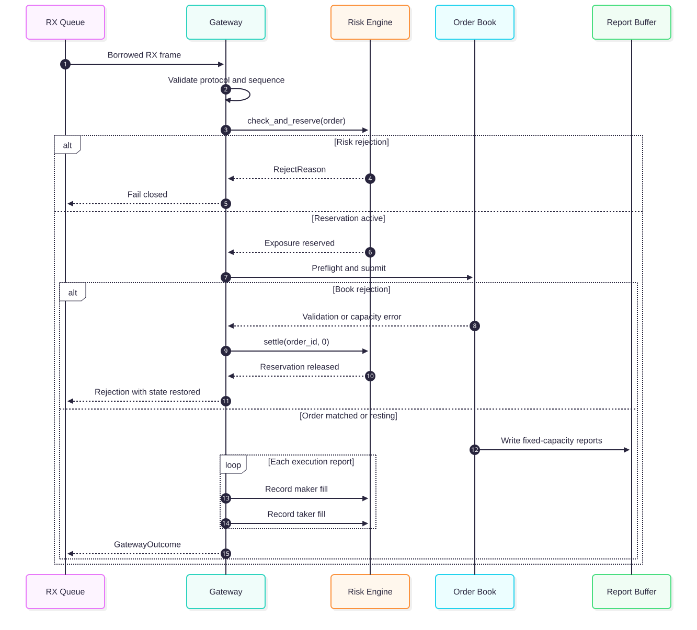

# hft-engine-rs

[](https://github.com/Ninian-Lemain/hft-engine-rs/actions/workflows/ci.yml)
[](LICENSE-MIT)
[](https://www.rust-lang.org/)

A deterministic, allocation-free Rust execution-gateway and matching-engine
vertical slice: RX frame lease -> lifetime-bound binary parsing -> session
sequencing -> fixed-capacity risk -> price-time matching/cancel -> execution
reports -> replay digest.

The design targets the same engineering concerns found in electronic trading
infrastructure: deterministic state transitions, conservative pre-trade risk,
bounded resources, explicit backpressure, price-time priority, session
sequencing, replayability, cache-aware cross-core handoff, and narrow driver
boundaries. It is a production-oriented foundation, not a claim that a public
portfolio repository replaces venue certification, proprietary feed handlers,
or measured kernel-bypass deployment work.

## Why This Project

- Honest data movement: parsing borrows the RX frame; cross-core normalized
  orders are a bounded single-copy handoff.
- Deterministic failure: fixed capacities reject explicitly and never silently
  overwrite state.
- Single-writer books: an instrument shard owns its risk state and order book.
- Hot-path discipline: integer prices and quantities, no locks, logging,
  syscalls, formatting, or allocation in the measured packet-to-report path.
- Contained unsafe: only SPSC slot access, the FFI wrapper, and the benchmark
  allocator use unsafe Rust.
- Lifecycle integrity: strict inbound sequencing, owner-authorized cancel,
  partial-fill reservation accounting, and fail-closed capacity behavior.

## Quick Start

```console
cargo run --release -p hft-cli -- replay-demo
cargo test --workspace --all-features
cargo run --release -p hft-bench
```

See [QUICKSTART.md](QUICKSTART.md) for all quality gates.

## Measured Results

The release harness warms the engine, processes 200,000 messages, and fails if
the measured path allocates or deallocates. Five consecutive portable smoke
runs on 2026-08-14 produced:

| Metric | Result |
| --- | ---: |
| Messages | 200,000 |
| Median aggregate mean | 76 ns/message |
| Aggregate mean range | 68-128 ns/message |
| Derived median throughput | ~13.2 million messages/second |
| p50 / p90 | 100 ns / 100 ns |
| Median p99 / p99.9 | 200 ns / 300 ns |
| Maximum range | 300 ns-73.4 us |
| Allocation / deallocation delta | 0 / 0 |
| SPSC maximum occupancy | 64 / 64 |
| Explicit backpressure events | 1 |

Environment: Intel N95, Windows 11, Rust 1.96.0, `x86_64-pc-windows-msvc`,
fat LTO, one codegen unit, and aborting panics. These figures include timer
overhead and desktop scheduler noise; the maximum range shows that jitter
directly. These results validate the benchmark and allocation discipline; they
are **not** a Linux/NIC production-latency claim.
See [docs/PERFORMANCE.md](docs/PERFORMANCE.md) for the reproducibility protocol.

The aggregate loop includes synthetic frame construction and gateway
processing. Sampled percentiles time `process_frame`: borrowed parsing, session
sequencing, risk, matching, report generation, and fill accounting. NIC,
kernel, and wire transit are outside the measurement boundary.

## Verification Evidence

| Gate | Evidence |
| --- | --- |
| Workspace correctness | Formatting, all-target check, Clippy with warnings denied, unit/integration/doc tests |
| Parser robustness | Boundary cases, malformed-input smoke, and a `cargo-fuzz` target |
| Concurrency | Cross-thread FIFO stress test and Loom Release/Acquire model |
| Memory safety | Miri on parser/risk/book and AddressSanitizer on the FFI crate |
| Hot-path allocation | Post-warm-up counter asserts zero allocation and deallocation deltas |
| Replay stability | Golden final-state digest with canonical byte-order encoding |
| Language boundary | Rust source-ratio gate and an allowlist for crates containing unsafe code |

## Architecture

| Crate | Responsibility | Hot-path allocation |
| --- | --- | --- |
| `hft-types` | Fixed-width domain types and reports | None |
| `hft-wire` | Validated lifetime-bound parsing | None |
| `hft-io` | RAII frame leases, in-memory and UDP baseline | Preallocated frame |
| `hft-spsc` | Bounded cache-aware SPSC handoff | None after construction |
| `hft-risk` | Fixed-capacity limits and exposure reservations | None |
| `hft-book` | Fixed-capacity price-time matching | None |
| `hft-gateway` | Transaction coordination and report accounting | None |
| `hft-replay` | Ordered replay and stable final-state digest | None in engine |
| `hft-ffi` | Optional vendor C ABI ownership wrapper | Vendor-defined |
| `hft-bench` | Allocation assertion and timing smoke harness | Zero measured delta |
| `hft-cli` | Cold-path operational entry point | Out of scope |

Each instrument group is intended to run as a single matching shard. If a
packet crosses cores, the supported design is normalization once into a fixed
size SPSC slot. That is a bounded single-copy handoff, not end-to-end zero-copy.

## Workflow Diagrams

### Packet-to-Report Data Path

[](docs/diagrams/packet-to-report.mmd)

The parser borrows the RX frame. Only the optional cross-core handoff copies a
normalized fixed-size order into a preallocated queue slot.

### New-Order Transaction

[](docs/diagrams/new-order-transaction.mmd)

Both SVG images are generated from the linked, version-controlled Mermaid
sources so architectural changes remain reviewable.

## Key Takeaways and Lessons Learned

| Lesson | Design decision | Evidence |
| --- | --- | --- |
| Ownership is part of latency design | Frame leases bind parser borrows to RX-buffer lifetime | `hft-io`, `hft-wire`, lease and truncation tests |
| Bounded state makes overload deterministic | Fixed arrays and SPSC slots reject instead of growing | Capacity, backpressure, and no-overwrite tests |
| Zero-copy claims need exact boundaries | Borrow the frame; describe cross-core normalization as one bounded copy | Architecture and safety documentation |
| Transactionality requires preflight | Check report/book capacity before mutation and roll back rejected reservations | Book preservation and gateway lifecycle tests |
| Atomic ordering needs a proof | Release publishes slots; Acquire observes publication and reclamation | Loom model and cross-thread FIFO stress test |
| Replay determinism is cross-platform | Canonical big-endian digest lanes plus a golden final-state value | `hft-risk` digest and `hft-replay` regression test |
| Benchmarks need scope and context | Separate zero-allocation evidence from unmeasured NIC/kernel latency | Release allocator gate and performance protocol |
| Unsafe code belongs at narrow boundaries | Keep domain, risk, matching, parsing, and replay in safe Rust | CI unsafe allowlist, Miri, and FFI AddressSanitizer |

The detailed design reflection is in
[Engineering Lessons Learned](docs/LEARNINGS.md).

## Capability Matrix

| Capability | State | Evidence / limitation |
| --- | --- | --- |
| Borrowed binary parser | Implemented | Boundary and malformed-input tests |
| New/cancel wire messages | Implemented | Fixed lengths and big-endian scalar fields |
| RAII RX lease | Implemented | In-memory and UDP buffer ownership |
| Fixed-capacity risk | Implemented | Quantity, notional, position, open-order, collar, duplicate, kill checks |
| Price-time book | Implemented | FIFO and price-priority tests |
| Deterministic replay | Implemented | Stable final-state digest test |
| Session sequence enforcement | Implemented | Duplicates/gaps fail closed without advancing |
| Owner-authorized cancel | Implemented | FIFO-preserving removal and exact risk release |
| Cache-aware SPSC | Implemented | Release/Acquire docs, stress test, Loom model |
| Allocation audit | Implemented | Release executable asserts zero measured deltas |
| UDP baseline | Implemented | Syscall path; not a latency claim |
| AF_XDP backend | Planned | Feature-gated availability marker only |
| Vendor SDK | Planned | Safe wrapper exists; no proprietary SDK linked |
| Hardware perf counters | Planned | Requires Linux/perf and a dedicated runner |

## Safety and Performance Limits

- No external venue traffic, persistence, replace, recovery journal, sequence
  retransmission protocol, authentication, or venue-certified session protocol
  is implemented.
- Order IDs are monotonically increasing per gateway session. Reuse and
  out-of-order IDs fail closed.
- The book rejects when report, order, per-price FIFO, or price-level capacity
  would be exceeded; capacity is selected at compile time.
- Timing output includes measurement overhead and is only a local smoke result.
  See [docs/PERFORMANCE.md](docs/PERFORMANCE.md).
- See [docs/SAFETY.md](docs/SAFETY.md) for every unsafe boundary and
  [docs/ARCHITECTURE.md](docs/ARCHITECTURE.md) for ownership.

## Review Path

For a focused engineering review:

1. `hft-wire`: borrowed validation and protocol boundaries.
2. `hft-risk`: conservative exposure and deterministic rejection order.
3. `hft-book`: price-time matching, transactional preflight, and cancel FIFO.
4. `hft-gateway`: sequence enforcement and risk/book lifecycle coordination.
5. `hft-spsc`: documented Release/Acquire ownership transfer.
6. `hft-bench`: measured allocation assertion and reproducibility limitations.

The protocol is specified in [docs/PROTOCOL.md](docs/PROTOCOL.md); operational
failure behavior is in [docs/OPERATIONS.md](docs/OPERATIONS.md).

## Project

- [Review](docs/REVIEW.md)
- [Engineering lessons learned](docs/LEARNINGS.md)
- [Roadmap](docs/ROADMAP.md)
- [Contributing](CONTRIBUTING.md)
- [Security](SECURITY.md)
- [Changes](CHANGES.md)

Licensed under the [MIT License](LICENSE-MIT).
